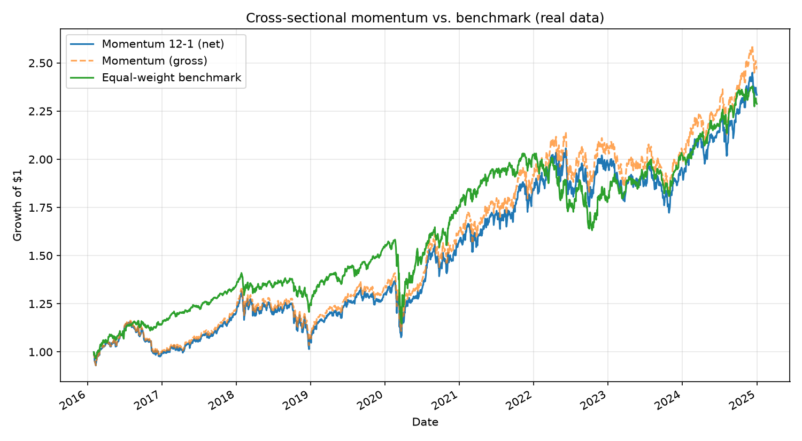

# Systematic Momentum Strategy — Backtesting Engine

[](https://github.com/sfondrinimaria02-del/momentum-backtest/actions/workflows/ci.yml)

[](LICENSE)

A transparent Python backtesting engine for a classic **12-1 cross-sectional momentum
strategy** on a diversified ETF universe. The project emphasizes reproducible research,
explicit execution assumptions, transaction costs, and tests for common backtesting errors.

*Maria Sfondrini — Master in Finance, Peking University HSBC Business School;
B.Sc. Computer System Engineering, Politecnico di Milano.*

## Why this project exists

Most public momentum backtests skip the details that decide whether the result is real:
they fill orders on the same bar the signal was computed (look-ahead), compare the
strategy to nothing or to an unfair benchmark, and ignore transaction costs entirely. This
engine is built to get those details right and be explicit about the ones it still
simplifies:

- **No look-ahead in execution.** A month-end signal is scheduled for the close of the
  first trading session *after* that signal date, never the same close used to compute it.
- **A fair benchmark, not a strawman.** The equal-weight benchmark shares the exact same
  universe, cost model, execution convention, and investable start date as the strategy —
  neither side gets extra market exposure during the other's signal warm-up.
- **Transaction costs are charged on actual turnover**, not assumed away.
- **Honest about what it doesn't fix**: the fixed ETF universe still embeds hindsight, and
  a long-only ETF portfolio retains substantial market beta relative to the academic
  long-short momentum factor — see Research Limitations below.

See [RESEARCH_NOTE.md](RESEARCH_NOTE.md) for the full research design and interpretation rules.

## Features

- **Signal:** trailing 12-month return excluding the most recent month, calculated on the
  actual final trading observation of each calendar month.
- **Portfolio:** equal-weight long allocation to the top quintile of valid signals.
- **Execution:** the signal is scheduled for the close of the first trading session after
  month-end. New weights earn returns from the following close-to-close interval.
- **Weight drift:** holdings move with asset returns between monthly rebalances.
- **Transaction costs:** linear costs are charged on actual one-way turnover,
  `sum(abs(target_weight - drifted_weight))`.
- **Benchmark:** a monthly rebalanced equal-weight portfolio using the same universe,
  cost model, execution convention, and investable start date.
- **Validated data loading:** downloads are checked for empty, partial, duplicated,
  non-finite, or non-positive values before use, and cached by date range *and* exact
  ticker universe.
- Config-free CLI with lookback/cost/quantile parameters, a deterministic synthetic-data
  mode for engine testing, full pytest suite, ruff linting, and GitHub Actions CI.

## Installation

Requires Python 3.10 or newer.

```bash
git clone https://github.com/sfondrinimaria02-del/momentum-backtest.git
cd momentum-backtest
python -m venv .venv
source .venv/Scripts/activate      # Windows (Git Bash); use .venv\Scripts\activate.bat for cmd.exe
# source .venv/bin/activate        # macOS/Linux
pip install -e ".[dev]"
```

## Usage

```bash
python -m momentum_backtest.cli
python -m momentum_backtest.cli --synthetic
python -m momentum_backtest.cli --lookback 6 --tc-bps 10 --quantile 0.2
# or, after installation:
momentum-backtest --lookback 6
```

Real-data runs download adjusted closing prices through `yfinance`. Each successful run
writes the following ignored artifacts under `results/`:

- a summary CSV;
- an equity-curve PNG;
- a JSON record containing parameters, package versions, universe, and evaluation dates.

## Results

Close-only methodology, 10 bps transaction costs, common evaluation window 1 February
2016–31 December 2024. Independently reproduced bit-for-bit against a fresh Yahoo Finance
pull on 16 July 2026 (see `results/metadata_real_L12.json` for the exact package versions
and universe from that run):

| Portfolio | CAGR | Ann. vol | Sharpe | Sortino | Max drawdown |
|---|---:|---:|---:|---:|---:|
| Momentum 12-1, net | **10.0%** | 15.6% | 0.69 | 0.96 | **−22.9%** |
| Momentum 12-1, gross | 10.7% | 15.6% | 0.73 | 1.02 | −22.6% |
| Equal-weight benchmark, net | 9.7% | **13.0%** | **0.78** | **1.08** | −27.6% |



Average one-way momentum turnover was 53.0% per rebalance. Momentum delivered a slightly
higher net CAGR and a shallower drawdown, but the diversified benchmark had the stronger
risk-adjusted performance. This is not evidence of a robust selection premium.

Historical adjusted prices can be revised. Regenerated claims should therefore be tied
to the output metadata file and a specific Git commit.

## Repository structure

```text
.
├── .github/workflows/ci.yml        # lint, coverage, and unit tests on Python 3.10 and 3.12
├── src/momentum_backtest/
│   ├── analysis.py                 # aligned strategy/benchmark orchestration
│   ├── backtest.py                 # execution, drift, turnover, and transaction costs
│   ├── cli.py                      # command-line entry point
│   ├── data.py                     # validated yfinance cache and synthetic generator
│   ├── metrics.py                  # CAGR, volatility, Sharpe, Sortino, drawdown
│   └── strategy.py                 # month-end signals and portfolio construction
├── tests/                          # deterministic tests; real data mocked at the API boundary
├── Momentum_Backtest.ipynb         # research workflow using the shared source modules
└── RESEARCH_NOTE.md                # methodology and interpretation framework
```

## Testing

```bash
pip install -e ".[dev]"
ruff check .
pytest --cov=momentum_backtest --cov-report=term-missing
```

The test suite covers signal timing, actual trading-month ends, portfolio normalization,
rebalance timing, transaction costs, aligned evaluation periods, input validation error
paths, and the yfinance response-parsing and caching logic (mocked at the API boundary -
no real network calls in the default run). CI has read-only repository permissions.

## Roadmap

- A point-in-time universe sourced from an institutional data provider, to remove the
  fixed-universe hindsight bias entirely rather than just documenting it.
- A long-short specification with explicit financing and borrow constraints.
- Volatility targeting and exposure controls.
- Walk-forward / out-of-sample analysis and bootstrap confidence intervals around the
  Sharpe/CAGR estimates, rather than a single point estimate over one historical sample.
- Explicit next-open execution and slippage modeling, as an alternative to the current
  (intentionally conservative) close-only fill assumption.

## Research limitations

- A long-only ETF portfolio is not the academic long-short momentum factor and retains
  substantial market beta.
- The fixed ETF universe mitigates delisting churn but remains selected with hindsight.
- Yahoo Finance is convenient rather than an institutional-grade point-in-time database.
- Linear costs omit market impact, bid-ask variation, taxes, and capacity constraints.
- A ten-year monthly sample is too short to establish a statistically robust edge.
- The engine does not model intraday fills; its close-only execution rule is intentionally
  conservative and explicit.

See [RESEARCH_NOTE.md](RESEARCH_NOTE.md) for the research design and interpretation rules.

## Disclaimer

This repository is an educational research project, not investment advice.

## License

Released under the [MIT License](LICENSE).
